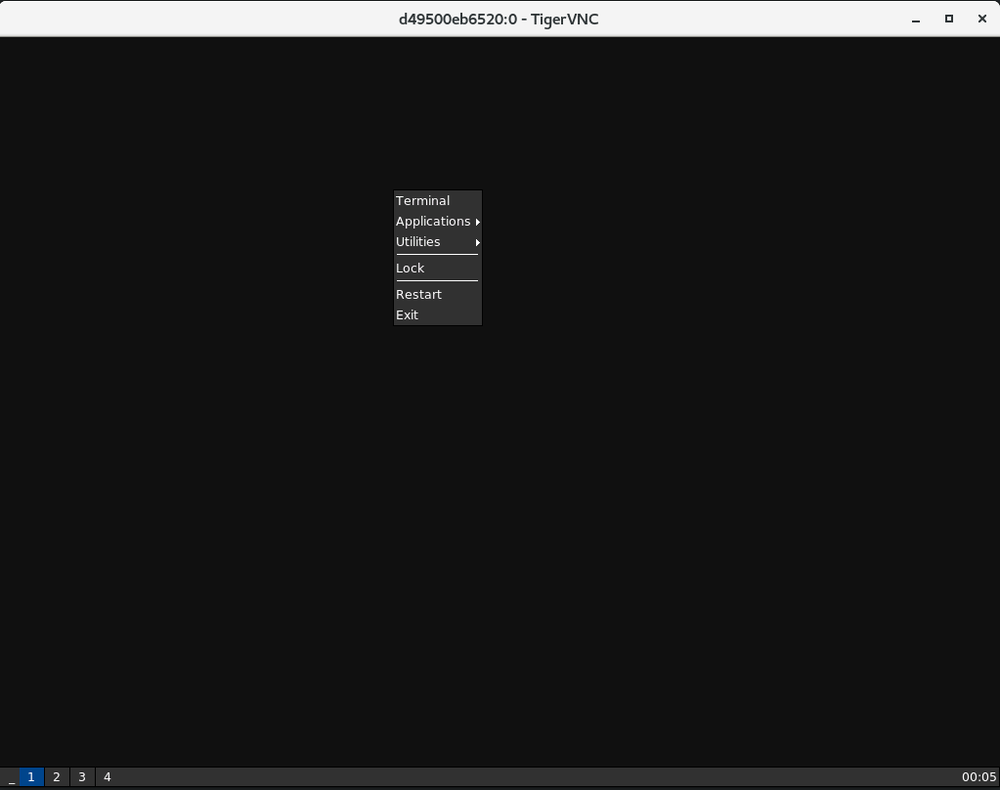

# Container Image based on Fedora with Virtual framebuffer, VNC server, and Joe - small window manager. 


This is a container image that runs a virtual frame buffer(Xvfb) with a small window manger (Joe)  that accessible via rfb protocol (VNC).

The components are :



## Build image

```bash
git clone https://github.com/tkagn/x11vnc-desktop.git
podman build -t x11vnc-desktop -f Dockerfile 
```

## Related Projects
 - [Joe's Window Manager](https://joewing.net/projects/jwm/): Lightweight stacking window manager for the X Window System.
 - [Xvfb](https://www.x.org/releases/X11R7.6/doc/man/man1/Xvfb.1.xhtml): virtual framebuffer X server for X Version 11.
 - [Fedora Base Image ](registry.fedoraproject.org/fedora): Fedora container image